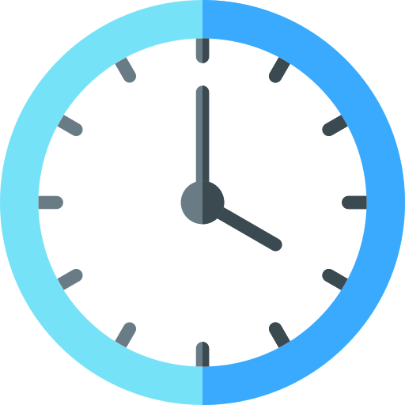

<div align="center">



# Analog Clock

[](https://github.com/Spike271/Analog-Clock/actions/workflows/Build%20for%20all%20platforms.yml)


[](https://github.com/Spike271/Analog-Clock/actions/workflows/deploy.yml)

</div>

## About the Project

Just a simple clock.

## Screenshot


## Features

This clock displays real-time with ticking sound.

## Technologies Used

- **Language**: C++
- **Graphics Library**: raylib  

## Prerequisites

Before building or running this project, ensure you have the following dependencies installed:

- C++ 20 compatible compiler or higher

### For Desktop
- [CMake](https://cmake.org/documentation/) (3.31 or higher)
- [Ninja](https://ninja-build.org/) (if you're not building for Visual Studio)

##### For Linux

> Info: Make sure to check out the [raylib wiki](https://github.com/raysan5/raylib/wiki/Working-on-GNU-Linux) to make sure you have all necessary dependencies installed on your machine. 

## For Web
- [Emscripten](https://emscripten.org/docs/getting_started/downloads.html)
- [CMake](https://cmake.org/documentation/) (3.31 or higher)

## Building the Project (For Desktop)

### Clone the Repository

Start by cloning the project from the GitHub repository:

```bash
# Clone the Repository
git clone https://github.com/Spike271/Analog-Clock.git
```

### For Windows (Visual Studio)

1. Generate build files:
   ```bash
   cmake -B build
   ```

2. Build the project:
   ```bash
   cmake --build build -j8 --config Release
   ```

### For Other Platforms (Also works for Windows)

1. Create and navigate to the build directory:
   ```bash
   mkdir build
   cd build
   ```

2. Generate the build system files using Ninja:
   ```bash
   cmake -G "Ninja" -D CMAKE_CXX_COMPILER=g++ -D CMAKE_BUILD_TYPE=Release ..
   ```

3. Build the project:
   ```bash
   ninja
   ```

---

### Building for Web

1. Ensure you have [Emscripten](https://emscripten.org/docs/getting_started/downloads.html) installed and activated in
   your environment.


2. Create and navigate to the build-web directory:
   ```bash
   mkdir build-web
   cd build-web
   ```

3. Generate the build files using Emscripten:
   ```bash
   emcmake cmake .. -DPLATFORM=Web -DCMAKE_BUILD_TYPE=Release
   ```

4. Build the project:
   ```bash
   emmake make
   ```

5. The build will generate the following files:
	- `Analog_Clock.html` - The HTML page to load the App
	- `Analog_Clock.js` - JavaScript code
	- `Analog_Clock.wasm` - WebAssembly binary
	- `Analog_Clock.data` - App resources

6. To run the Application, you'll need to serve these files using a local web server:
   ```bash
   # Using Python 3
   python3 -m http.server 8080
   # Then open localhost:8080/Analog_Clock.html in your browser

   # Alternatively, if you have the emscripten binaries in your path, you can run the following command
   emrun Analog_Clock.html
   ```
